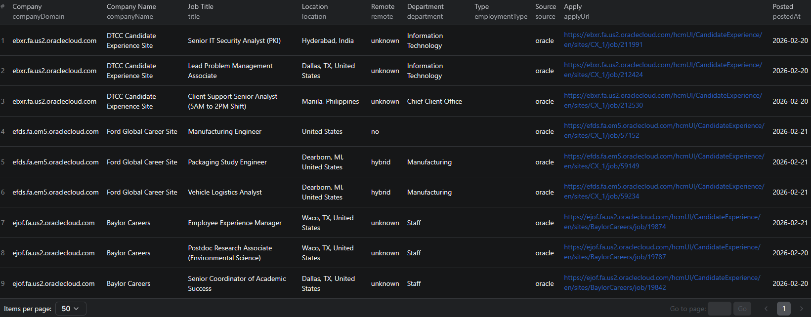

# How to Scrape Company Career Pages in Node.js

This example shows how to scrape company career pages in Node.js using the [Company Career Page Scraper](https://apify.com/piotrv1001/company-career-page-scraper) actor on Apify. No browser automation or HTML parsing needed — just pass in company URLs and get back structured job listings.



## What this example does

- Calls the Company Career Page Scraper actor via the Apify API
- Passes a list of company URLs as input
- Waits for the actor run to finish
- Fetches results from the run's dataset
- Prints each job listing to the console

## Prerequisites

- [Node.js](https://nodejs.org/) v18 or higher
- An [Apify account](https://console.apify.com/sign-up)
- An [Apify API token](https://console.apify.com/settings/integrations)

## Installation

```bash
npm install
```

## Environment setup

Copy the example env file and add your Apify API token:

```bash
cp .env.example .env
```

Then open `.env` and replace the placeholder with your token:

```
APIFY_TOKEN=your_apify_token_here
```

## Usage

```bash
npm start
```

## Code example

```js
import { ApifyClient } from 'apify-client';
import 'dotenv/config';

// Initialize the ApifyClient with your Apify API token
// Set APIFY_TOKEN in your .env file (copy .env.example to get started)
const client = new ApifyClient({
    token: process.env.APIFY_TOKEN,
});

// Prepare Actor input
const input = {
    "startUrls": [
        {
            "url": "https://www.figma.com"
        },
        {
            "url": "https://emcm.fa.us2.oraclecloud.com/hcmUI/CandidateExperience/en/sites/WMCareers/jobs"
        }
    ]
};

// Run the Actor and wait for it to finish
const run = await client.actor("piotrv1001/company-career-page-scraper").call(input);

// Fetch and print Actor results from the run's dataset (if any)
console.log('Results from dataset');
console.log(`💾 Check your data here: https://console.apify.com/storage/datasets/${run.defaultDatasetId}`);
const { items } = await client.dataset(run.defaultDatasetId).listItems();
items.forEach((item) => {
    console.dir(item);
});

// 📚 Want to learn more 📖? Go to → https://docs.apify.com/api/client/js/docs
```

## Example output

See [`sample-output.json`](./sample-output.json) for a full example. Each job listing includes:

| Field | Description |
|---|---|
| `companyDomain` | Domain of the company (e.g. `figma.com`) |
| `companyName` | Company name |
| `source` | ATS platform detected (e.g. `greenhouse`, `ashby`, `oracle`) |
| `careersUrl` | URL of the careers page |
| `jobId` | Unique job identifier |
| `title` | Job title |
| `location` | Full location string |
| `locationCity` / `locationCountry` | Parsed city and country |
| `remote` | Remote status: `remote`, `hybrid`, `on-site`, or `unknown` |
| `employmentType` | Full-time, part-time, contract, etc. |
| `department` | Team or department |
| `seniority` | Seniority level |
| `postedAt` | ISO 8601 posting date |
| `applyUrl` | Direct link to the job application |
| `skills` | List of required skills |
| `requirements` | List of job requirements |
| `responsibilities` | List of responsibilities |
| `benefits` | List of offered benefits |
| `salary` | Salary range (when available) |
| `descriptionText` | Plain-text job description |
| `descriptionHtml` | HTML job description |
| `scrapedAt` | Timestamp of when the job was scraped |

## Use cases

- **Job market research** — track hiring trends across companies and industries over time
- **Recruiting and talent sourcing** — monitor competitors or target companies for new openings
- **HR analytics** — analyze in-demand skills and compensation ranges in a given sector
- **Job board aggregation** — build a niche job board by aggregating listings from many company career pages
- **Sales prospecting** — identify companies actively hiring in specific roles or departments as buying signals

## Try the actor on Apify

**[Open the Company Career Page Scraper on Apify](https://apify.com/piotrv1001/company-career-page-scraper)**

## Related resources

- [How to Scrape Jobs from Any Company Career Page](https://www.falconscrape.com/blog/how-to-scrape-jobs-from-any-company-career-page) — blog post covering the scraping approach in depth

## License

MIT
